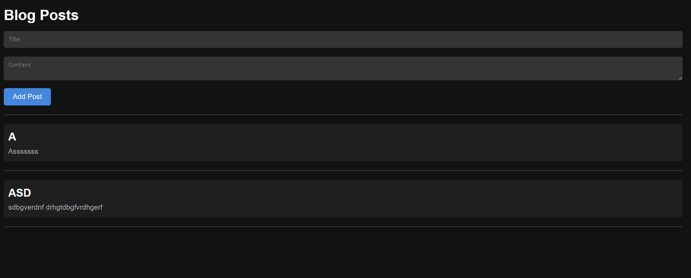

# Blog App



## Commands

1. ```python app.py```
2. ```python app.py```
3. ```docker build -t blogpost-backend:latest backend/```
4. ```docker build -t blogpost-frontend:latest frontend/```
5. ```docker build -t blogpost-database:latest database/```
6. ```docker-compose up```
7. ```docker-compose up```
8. ```docker-compose up```
9. ```docker login```
10.

```bash
docker tag blogpost-backend:latest lithira/blogpost-backend:latest
docker push lithira/blogpost-backend:latest
```

11.

```bash
docker tag blogpost-frontend:latest lithira/blogpost-frontend:latest
docker push lithira/blogpost-frontend:latest
```

12.

```bash
docker tag blogpost-database:latest lithira/blogpost-database:latest
docker push lithira/blogpost-database:latest
```

13. ```kubectl apply -f ks/```

14. ```minikube dashboard```

15. ```kubectl delete -f k8s/```

16. 
